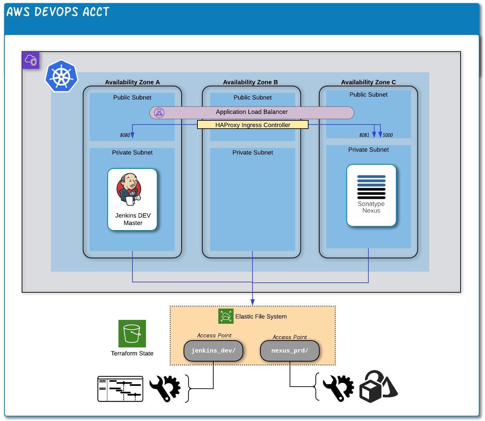

# **Basic CI/CD Stand-Alone POC Cluster in EKS**



#### Prerequisites
- S3 bucket for Terraform state files (configured in 'terraform/backendd.tfvars')
- Local machine with command line terminal and Docker client installed
- AWS account with appropraite permissions for infrastructure deployment
## **Utilizing this Repo**
Clone repo and change to directory just above `eks-experiment`
1. **Run Docker Container with Terraform 13.x / Kubectl / Helm / AWS CLI**

`docker run -u 1000:1000 -v $(pwd)/eks-experiment:/opt/app/eks -it secretlyelvis/devops-poc:tf13`

2. **Initialize AWS Credentials**
```
aws configure set aws_access_key_id "<ACCESS_KEY>"
aws configure set aws_secret_access_key "<SECRET_KEY>"
aws configure set default.region "ap-southeast-2"
```
3. **Deploy Base Infrastructure**
```
cd terraform
./tf-run init aws/
./tf-run plan aws/
./tf-run apply
```
Make note of the output vlaues as many are used in subsequent commands:
- `region`
- `cluster_name`
- `pstorage-fs_fsid`
- `pstorage-jenkins_apid`
- `pstorage-nexus_apid`
- `alb-policy-arn`

4. **Configure 'kubectl' to utilize EKS Cluster**

`aws eks --region <region> update-kubeconfig --name <cluster name>`

5. **Install Required Kubernetes Components**

- Create a namespace for DevOps POC components:

`kubectl create namespace devops-poc`

- Install EFS CSI driver:

`kubectl apply -k "github.com/kubernetes-sigs/aws-efs-csi-driver/deploy/kubernetes/overlays/stable/ecr/?ref=release-1.0"`

- Install HAProxy Ingress Controller:

```
helm repo add haproxytech https://haproxytech.github.io/helm-charts
helm repo update
helm install devops-poc-ingress -n devops-poc \
    --set controller.service.type=LoadBalancer \
    --set controller.service.annotations."service\.beta\.kubernetes\.io/aws-load-balancer-cross-zone-load-balancing-enabled"="true" \
    haproxytech/kubernetes-ingress
```

_Note: To enable debug-level logs, include '--set controller.logging.level=debug' in above command_

6. **Deploy Jenkins (Charts)**

- Create a namespace for Jenkins DEV components:

`kubectl create namespace jenkins-dev`

- Deploy PersistentVolume for Jenkins DEV:

Make the following replacements in file `helm/jenkins/jenkins-pv.yml`:

  `<FS_ID>` --> `pstorage-fs_fsid` value from Terraform (*e.g. 'fs-04be623c'*)

  `<FSAP_ID>` --> `pstorage-jenkins_apid` (*e.g. 'fsap-055e6d74b33a0ed6a'*)

`kubectl apply -f helm/jenkins/jenkins-pv.yml`

- Deploy Service Account and Cluster Role for Jenkins DEV:

`kubectl apply -f helm/jenkins/jenkins-sa.yml`

- Configure Helm and deploy `jenkinsci/jenkins` chart:

_Optional: update the `installPlugins:` section of `helm/jenkins/jenkins-values.yml` to add any desired plugins during install._
```
helm repo add jenkinsci https://charts.jenkins.io
helm repo update
helm install jenkins-dev -n jenkins-dev \
    -f helm/jenkins/jenkins-values.yml \
    jenkinsci/jenkins
```
The server can take several minutes to start up as modules are installed.  Check status with:

`kubectl get pods -n jenkins-dev`

If all was successful, you will see something simi.ar to:

```
NAME                          READY   STATUS    RESTARTS   AGE
jenkins-dev-64dcc79c5-hc2h5   2/2     Running   0          2m54s
```

_Note: Jenkins is installed under the path '/jenkins'.  To access, visit '<LB_URL>/jenkins'_

- Retrieve the generated 'admin' user password for initial access:
```
path="{.data.jenkins-admin-password}"
secret=$(kubectl get secret -n jenkins-dev jenkins-dev -o jsonpath=$path)
echo $(echo $secret | base64 -d)
```

7. **Deploy Nexus (YAML)**

- Create a namespace for Nexus PRD components:

`kubectl create namespace nexus-prd`

- Make the following replacements in file `helm/jenkins/nexus-pv.yml` and deploy:

  `<FS_ID>` --> `pstorage-fs_fsid` value from Terraform (*e.g. 'fs-04be623c'*)

  `<FSAP_ID>` --> `pstorage-nexus_apid` (*e.g. 'fsap-055e6d74b33a0ed6a'*)

`kubectl apply -f helm/nexus/nexus-pv.yml`

- Deploy the Nexus applicatoni stack:

`kubectl apply -f helm/nexus/nexus-deploy.yml`

_Note: Nexus is installed under the path '/'.  To access, visit '<LB_URL>/'_

#### TODO

- Adapt codebase to accomodate existing VPC & Subnets
- Deploy into Loyalty AWS
- Explore routing based on subdomain rather than path (Nexus only works on /)
- Configure SSL-redirect, certificate for all services
- Account setup
- First docker image build via Jenkins
- Ingress configuration through AWS ALB Controller
- Locate (or build) a suitable Helm Chart for Nexus
- Jenkins access to Nexus pod/namespace within Kubernetes
- Security improvements
- Enable cluster-level logging?
- Decision: separate load balancers (to enable individual security config)?