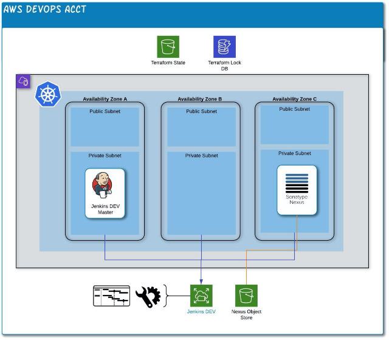

# **CI/CD Stand-Alone POC Cluster in EKS**



#### Prerequisites
- S3 bucket for state files
- Machine with Docker client installed
- AWS account with appropraite permissions for infrastructure deployment
## **Utilizing this Repo**
Clone repo and change to directory just above `eks-experiment`
1. **Run Docker Container with Terraform 13 / Kubectl / Helm / AWS CLI**

`docker run -u 1000:1000 -v $(pwd)/eks-experiment:/opt/app/eks -it secretlyelvis/tf-k8s-aws:v13`

2. **Initialize AWS Credentials**
```
aws configure set aws_access_key_id "<ACCESS_KEY>"
aws configure set aws_secret_access_key "<SECRET_KEY>"
aws configure set default.region "ap-southeast-2"
```
3. **Change to Code Directory and Deploy Base Infrastructure**
```
cd eks
./tf-run init aws-tf
./tf-run plan aws-tf
./tf-run apply
```
Record the 'cluster_name' and 'region' details from the Terraform output.  To review output again, enter:

`terraform output`

4. **Configure kubectl and install EFS CSI driver**
_Note: not required if PersistentVolumes use 'nfs' driver_
```
aws eks --region <region> update-kubeconfig --name <cluster name>
kubectl apply -k "github.com/kubernetes-sigs/aws-efs-csi-driver/deploy/kubernetes/overlays/stable/ecr/?ref=release-1.0"
```
5. **Complete EKS Configuration -- Terraform Option**
```
rm -rf .terraform
./tf-run init k8s-tf
./tf-run plan k8s-tf
./tf-run apply
```
6. **Complete EKS Configuration -- Kubernetes Option**

In file 'pv.yml' replace "<EFS_URL>" with output of 'pstorage-fs_dns', then run:

`kubectl apply -f ./pv.yml`

7. **Deploy Jenkins and Nexus via Helm**

## Deploy Jenkins

### Deploy Jenkins helm chart to Kubernetes
```bash
# Init helm and tiller on your cluster
$ helm init

# Deploy the Jenkins helm chart
# (same command for install and upgrade)
$ helm upgrade --install jenkins ./helm/jenkins-k8s
```

### Data persistence
By default, in Kubernetes, the Jenkins deployment uses a persistent volume claim that is mounted to `/var/jenkins_home`.
This assures your data is saved across crashes, restarts and upgrades.

## Deploy Nexus

## Variables
To be able to use this package, the following variables should be set.
see values.yaml

## Chart Details
This chart uses the docker image from [sonatype](https://github.com/sonatype/docker-nexus3).

## Installing the chart

## Configuration
The following tables lists the configurable parameters of the Nexus chart and their default values.

|Parameter|Description|Default|
|---------|-----------|-------|
|`hostName`|Host Name of this Instance|`nexus.example.com`|
|`containerPort`|Port of the container|`8081`|
|`maxMem`|Resource limit memory (-Xmx)|`1200M`|
|`minMem`|Minimum Memory (-Xms)|`1200M`|
|`javaOpts`|Additional options for the JVM|''|
|`persistence.path`|Path where all data on the host is stored|`/data/nexus`|

Specify each parameter using the --set key=value[,key=value] argument to helm install.

Alternatively, a YAML file that specifies the values for the parameters can be provided while installing the chart. For example,

```bash
$ helm install --name my-nexus -f values.private.yaml nexus-x.x.x.tgz
```

> **Tip**: You can use the default [values.yaml](values.yaml)

The initial Username/Pasword combination for the first login is: `admin/admin123`.

## Persistence
To be able to keep stateful data in the nexus kubernetes container, the following path is used:

```
/data/nexus
```

Right now, we do use HostPathes, which do not work in a real cluster environment (like AWS or GCE). Please adopt this one to your own needs.

The above mentioned path should be read/writable on the host for the user 1000.

### TODO
- [ ] configuration of Jenkins
- [ ] configuration for Nexus

